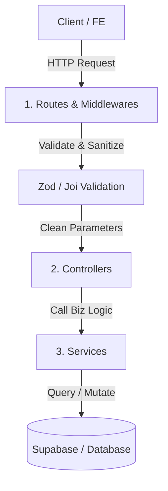

# Owly Project Coding Standards and I/O Conventions

This document outlines all technical standards, naming conventions, and data input/output (I/O) design flow rules applicable to both the Backend (Express.js) and Frontend (React.js + Vite & React Native + Expo) of the **Owly** project.

---

## I. Naming Conventions & File Structures

### 1. Directories and Files
*   **Directories:** Use lowercase nouns or `kebab-case` for multi-word folders.
    *   *Examples:* `controllers`, `services`, `custom-hooks`, `pages`.
*   **React Component Files (Frontend):** Use `PascalCase` with a `.jsx` (or `.tsx`) extension.
    *   *Examples:* `UserProfile.jsx`, `Sidebar.jsx`, `Button.jsx`.
*   **Logic / Utils / Hooks / Routes / Controllers:** Use `camelCase` with a `.js` (or `.ts`) extension (or `.jsx`/`.tsx` if they contain React components).
    *   *Examples:* `errorHandler.js`, `useAuth.js`, `formatDate.js`, `userController.js`.
*   **Configuration Files (Config):** Use lowercase or `kebab-case`.
    *   *Examples:* `vite.config.js`, `eslint.config.js`, `pnpm-lock.yaml`.

### 2. Variables, Functions, and Classes
*   **Variables & Functions:** Use `camelCase`. Function names should be verbs or verb phrases.
    *   *Examples:* `const userData = ...`, `function getUserProfile() { ... }`.
*   **Constants:** Use `UPPER_SNAKE_CASE`.
    *   *Examples:* `const PORT = 5000;`, `const MAX_RETRY_LIMIT = 5;`.
*   **Classes:** Use `PascalCase`.
    *   *Examples:* `class AppError extends Error { ... }`.
*   **Database Fields (Supabase):** Use `snake_case`.
    *   *Examples:* `user_id`, `created_at`, `is_active`.
*   **React Props & Event Handlers:**
    *   *Value props:* Use `camelCase` (e.g., `userId`, `themeColor`).
    *   *Callback props:* Start with `on` (e.g., `onClick`, `onClose`, `onUserUpdate`).
    *   *Event handlers inside components:* Start with `handle` (e.g., `handleFormSubmit`, `handleClose`).

---

## II. Backend Standards (Express.js)

### 1. Data Flow Architecture (Monolithic Layered Architecture)
The processing flow of a Request goes through the following layers:


### 2. Input Standards
*   **Strict Validation at the Entry:** Never pass raw data (`req.body`, `req.query`, `req.params`) directly into Controllers/Services without validation.
*   **Tiếng Việt hóa thông báo lỗi:** Toàn bộ thông báo lỗi trả về cho client (đặc biệt là lỗi validate đầu vào) **bắt buộc phải viết bằng Tiếng Việt** thân thiện với người dùng cuối.
*   **Zod Validation Middleware:** Định nghĩa schema chi tiết và sử dụng middleware `validate(schema)` để chặn dữ liệu không hợp lệ ngay tại tầng Route:
    ```javascript
    // Định nghĩa Schema (validation/authSchema.js)
    import { z } from 'zod';
    export const signUpSchema = z.object({
      email: z.string().email('Email không đúng định dạng'),
      password: z.string().min(6, 'Mật khẩu phải có ít nhất 6 ký tự'),
      phone: z.string().regex(/^(0[3|5|7|8|9])+([0-9]{8})$/, 'Số điện thoại không đúng định dạng')
    });
    ```
    ```javascript
    // Áp dụng tại Route (routes/authRoutes.js)
    import { validate } from '../middlewares/validate.js';
    import { signUpSchema } from '../validation/authSchema.js';
    router.post('/signup', validate(signUpSchema), authController.signUp);
    ```
*   **Separation of Concerns:** Controllers must extract only the required parameters from the request object and pass them explicitly (e.g., `userService.login(email, password)`) instead of passing the entire `req` object to the Service layer.

### 3. Output Standards & Error Handling
*   **Successful Response Format (HTTP 2xx):**
    Always return a unified JSON structure:
    ```json
    {
      "success": true,
      "data": {
        // Returned data payload (Object or Array)
      }
    }
    ```
*   **Failed Response Format (HTTP 4xx, 5xx):**
    Never expose stack traces to the client in Production.
    ```json
    {
      "success": false,
      "message": "User-friendly error message",
      "errors": [] // Error details (e.g., validation error messages)
    }
    ```
*   **Centralized Error Handling:**
    *   Use an `asyncHandler` wrapper to automatically catch and forward asynchronous errors to the final error handling middleware.
    *   All business/domain errors must be thrown explicitly using custom error classes (e.g., `AppError(message, statusCode)`).

---

## III. Frontend Standards (React.js + Vite)

### 1. UI & Logic Boundary Separation
*   **No Direct API Calls in Components:** Avoid using `useEffect` containing direct fetch/API calls inside JSX visual components.
*   **Solution:** Separate data fetching and local state management into **Custom Hooks** inside the `hooks/` directory.
    ```javascript
    // hooks/useUserProfile.js
    export function useUserProfile(userId) {
      const [profile, setProfile] = useState(null);
      const [loading, setLoading] = useState(true);

      useEffect(() => {
        apiService.getUser(userId)
          .then(res => setProfile(res.data))
          .finally(() => setLoading(false));
      }, [userId]);

      return { profile, loading };
    }
    ```

### 2. Input Standards (Receiving Data from API)
*   **Centralized Axios Instance:** Define base URLs, timeouts, and authorization headers in a single shared configuration file.
*   **Response Interceptors:** Use interceptors to handle global system errors automatically:
    *   `401 Unauthorized`: Clear tokens from local storage and redirect users to the Login page.
    *   `500 Internal Error`: Show a generic system error toast using Mantine Notifications.
    *   Automatically extract the `.data` property so that hooks/components only receive clean data payload.

### 3. Output Standards (Sending Data)
*   **Client-side Validation:** Validate forms before submitting them to the server (use Mantine Form Validation or Zod in combination with form libraries).
*   **State Synchronization (Zustand Stores):**
    *   Separate global states (such as logged-in User info, application Theme) into Zustand stores.
    *   Keep local states (like form inputs or UI modal states) within the local component using `useState`.

---

## IV. Mobile Standards (React Native + Expo)

### 1. Directory Structure & Navigation (Expo Router)
*   **Routing Architecture:** The project uses **Expo Router** for file-based routing located under the `app/` directory.
*   **Sub-directory Structure:**
    *   `app/`: Contains screens and layouts (`_layout.tsx`, `index.tsx`, `(tabs)/`, etc.).
    *   `components/`: Contains shared reusable UI components (e.g., `Button.tsx`, `Card.tsx`).
    *   `hooks/`: Contains custom hooks handling API calls and local states.
    *   `constants/`: Contains constants like colors (`Colors.ts`), layouts, configs.
    *   `services/`: Contains the Axios client setup and API endpoints.

### 2. UI & Styling Standards
*   **Mantine UI Incompatibility:** Since Mantine UI is web-only, mobile interfaces must be built using native React Native components (`View`, `Text`, `TouchableOpacity`, `ScrollView`, `FlatList`).
*   **Safe Area Management:** Always wrap screens in `SafeAreaView` from `react-native-safe-area-context` to prevent layout overlaps with notches, status bars, or home indicator areas.
*   **Styling:** Use Tailwind CSS via **NativeWind** or React Native's standard `StyleSheet.create`. Avoid inline styles unless style values are dynamic.
*   **Images & Assets:** Use `<Image>` or suitable SVG libraries, and always optimize image sizes before adding them to the `assets` folder.

### 3. Networking & API Integration
*   **API URL for Local Development:**
    *   Do not use `localhost` or `127.0.0.1` as the base API URL on mobile, as emulator/simulator environments cannot resolve it.
    *   Use the local development machine's internal IP address (e.g., `http://192.168.x.x:5000`) or configure it via Expo's env variables (`EXPO_PUBLIC_API_URL`).
*   **State Management:** Reuse **Zustand** to construct stores for tokens and user details, mimicking the Web implementation.

---

## V. Timezone & Date-Time Conventions

The application primarily targets the Vietnamese market (timezone **UTC+7** / Asia/Ho_Chi_Minh). To avoid timezone discrepancies between clients (Web/Mobile), backend (Express.js), and the database (Supabase), adhere to the following rules:

### 1. Database Storage (Supabase / Postgres)
*   **Data Type:** Use `timestamptz` (Timestamp with Time Zone) for all columns storing time events (e.g., `created_at`, `updated_at`, `scheduled_at`).
*   **Default Value:** Always default to `now()` or `timezone('utc'::text, now())` so that Supabase records timestamps in UTC upon record creation.
*   **No Local Time Storage:** Never add timezone offset (+7 hours) manually before saving raw strings to the database. This prevents errors when querying, filtering, or aggregating dates inside PostgreSQL.

### 2. Backend Processing (Express.js)
*   **Data Transmission Standard:** API payloads must transfer dates as standard **ISO 8601** strings containing explicit timezone offsets (e.g., `2026-06-22T14:35:37Z` or `2026-06-22T21:35:37+07:00`).
*   **Libraries:** Use libraries like `dayjs` or `date-fns` to parse, compare, and manipulate dates. Avoid using JavaScript's default `Date` object for complex timezone calculations.

### 3. Frontend Presentation (Web & Mobile)
*   **Timezone Conversion:** The frontend receives ISO 8601 (UTC) dates from the API and converts them to the user's local timezone (defaulting to UTC+7 for Vietnam).
*   **Formatting:** Use common helper functions under `utils/formatDate.js` (or `.ts`) to format dates for users (e.g., `DD/MM/YYYY HH:mm` or relative labels like *"5 minutes ago"*).

---

## VI. Quality Automation

To ensure strict adherence to the standards above, the project utilizes the following automated workflows:

1.  **Auto-Formatting:** Use **Prettier** to automatically format spacing, semicolons, and quotes.
2.  **Linter:** Use **ESLint** to verify unused variables, syntax problems, or hook rules violations.
3.  **Git Hooks (Husky + lint-staged):**
    *   Every `git commit` automatically triggers ESLint and Prettier on staged files.
    *   If errors are found, the commit is aborted until they are resolved.
