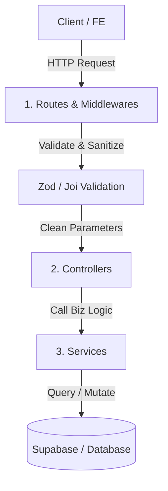

# Quy Chuẩn và Tiêu Chuẩn Đầu Vào/Đầu Ra Dự Án Owly

Tài liệu này tổng hợp toàn bộ các tiêu chuẩn kỹ thuật, quy tắc đặt tên, và thiết kế luồng dữ liệu đầu vào/đầu ra (Input/Output) áp dụng cho cả Backend (Express.js) và Frontend (React.js + Vite) của dự án **Owly**.

---

## I. Quy Chuẩn Đặt Tên & Cấu Trúc File (Naming Conventions)

### 1. Thư mục và File
*   **Thư mục (Directories):** Sử dụng danh từ viết thường (`lowercase`) hoặc `kebab-case` nếu ghép nhiều từ.
    *   *Ví dụ:* `controllers`, `services`, `custom-hooks`, `pages`.
*   **File React Component (Frontend):** Sử dụng `PascalCase` với đuôi `.jsx`.
    *   *Ví dụ:* `UserProfile.jsx`, `Sidebar.jsx`, `Button.jsx`.
*   **File Logic / Utils / Hook / Route / Controller:** Sử dụng `camelCase` với đuôi `.js` (hoặc `.jsx` nếu chứa React component).
    *   *Ví dụ:* `errorHandler.js`, `useAuth.js`, `formatDate.js`, `userController.js`.
*   **File Cấu hình (Config):** Sử dụng `lowercase` hoặc `kebab-case`.
    *   *Ví dụ:* `vite.config.js`, `eslint.config.js`, `pnpm-lock.yaml`.

### 2. Biến, Hàm và Class
*   **Biến & Hàm:** Sử dụng `camelCase`. Tên hàm nên là động từ hoặc cụm động từ.
    *   *Ví dụ:* `const userData = ...`, `function getUserProfile() { ... }`.
*   **Hằng số (Constants):** Sử dụng `UPPER_SNAKE_CASE`.
    *   *Ví dụ:* `const PORT = 5000;`, `const MAX_RETRY_LIMIT = 5;`.
*   **Class:** Sử dụng `PascalCase`.
    *   *Ví dụ:* `class AppError extends Error { ... }`.
*   **Trường dữ liệu trong Database (Supabase):** Dùng `snake_case`.
    *   *Ví dụ:* `user_id`, `created_at`, `is_active`.
*   **React Props & Event Handlers:**
    *   *Props nhận giá trị:* Dùng `camelCase` (ví dụ: `userId`, `themeColor`).
    *   *Props nhận callback:* Bắt đầu bằng `on` (ví dụ: `onClick`, `onClose`, `onUserUpdate`).
    *   *Hàm xử lý sự kiện trong Component:** Bắt đầu bằng `handle` (ví dụ: `handleFormSubmit`, `handleClose`).

---

## II. Tiêu Chuẩn Cho Backend (Express.js)

### 1. Kiến Trúc Luồng Dữ Liệu (Monolithic Layered Architecture)
Luồng xử lý một Request đi qua các lớp như sau:


### 2. Tiêu Chuẩn Đầu Vào (Input)
*   **Validate Nghiêm Ngặt Ở Cửa Ngõ:** Không chuyển dữ liệu thô (`req.body`, `req.query`, `req.params`) trực tiếp vào Controller/Service mà chưa kiểm tra.
*   **Giải Pháp:** Sử dụng thư viện **Zod** để định nghĩa schema và validate bằng middleware trước khi vào controller:
    ```javascript
    // Định nghĩa Schema
    import { z } from 'zod';
    export const loginSchema = z.object({
      email: z.string().email('Email không đúng định dạng'),
      password: z.string().min(6, 'Mật khẩu phải tối thiểu 6 ký tự'),
    });
    ```
*   **Tách Biệt Đối Tượng:** Controller chỉ trích xuất các thuộc tính cần thiết từ request và truyền dạng tham số tường minh (ví dụ: `userService.login(email, password)`) thay vì truyền cả đối tượng `req` vào tầng Service.

### 3. Tiêu Chuẩn Đầu Ra (Output) & Xử Lý Lỗi
*   **Định Dạng Response Thành Công (HTTP 2xx):**
    Phải luôn trả về một cấu trúc JSON thống nhất:
    ```json
    {
      "success": true,
      "data": {
        // Dữ liệu trả về ở đây (Object hoặc Array)
      }
    }
    ```
*   **Định Dạng Response Thất Bại (HTTP 4xx, 5xx):**
    Không để lộ Stack Trace của lỗi cho Client ở môi trường Production.
    ```json
    {
      "success": false,
      "message": "Thông báo lỗi thân thiện với người dùng",
      "errors": [] // Chi tiết lỗi (nếu có, ví dụ lỗi validation)
    }
    ```
*   **Xử Lý Lỗi Tập Trung (Centralized Error Handling):**
    *   Sử dụng một wrapper `asyncHandler` để chuyển lỗi không đồng bộ sang middleware xử lý lỗi cuối cùng.
    *   Tất cả các lỗi nghiệp vụ chủ động ném ra bằng class lỗi tùy chỉnh (ví dụ: `AppError(message, statusCode)`).

---

## III. Tiêu Chuẩn Cho Frontend (React.js + Vite)

### 1. Phân Tách Giao Diện Và Logic (UI & Logic Boundary)
*   **Không Gọi API Trực Tiếp Trong Component:** Tránh viết `useEffect` chứa các hàm fetch API trực tiếp tại file JSX hiển thị UI.
*   **Giải Pháp:** Tách logic fetch dữ liệu và xử lý state cục bộ thành các **Custom Hooks** trong thư mục `hooks/`.
    ```javascript
    // hooks/useUserProfile.js
    export function useUserProfile(userId) {
      const [profile, setProfile] = useState(null);
      const [loading, setLoading] = useState(true);

      useEffect(() => {
        apiService.getUser(userId)
          .then(res => setProfile(res.data))
          .finally(() => setLoading(false));
      }, [userId]);

      return { profile, loading };
    }
    ```

### 2. Tiêu Chuẩn Đầu Vào (Nhận Dữ Liệu Từ API)
*   **Cấu Hình Axios Instance Tập Trung:** Thiết lập baseUrl, cấu hình timeout, headers (authorization) tại một file chung.
*   **Response Interceptor:** Sử dụng interceptor để xử lý các mã lỗi hệ thống một cách tự động:
    *   `401 Unauthorized`: Xóa token ở local storage và chuyển hướng người dùng về trang Đăng nhập.
    *   `500 Internal Error`: Hiển thị thông báo lỗi hệ thống chung qua Mantine Notification Toast.
    *   Bóc tách sẵn trường `.data` để component/hook chỉ nhận về cục data sạch.

### 3. Tiêu Chuẩn Đầu Ra (Gửi Dữ Liệu Đi)
*   **Kiểm Tra Dữ Liệu Ở FE (Client-side Validation):** Validate form trước khi submit lên server (sử dụng Mantine Form Validation hoặc Zod kết hợp với form library).
*   **Đồng Bộ Trạng thái State (Zustand Stores):**
    *   Tách biệt dữ liệu toàn cục (Global State) như thông tin User đã đăng nhập, Theme hệ thống vào Zustand.
    *   Dữ liệu cục bộ (Local State) của form hoặc các UI component khác thì chỉ giữ lại trong component đó bằng `useState`.

---

## IV. Kiểm Soát Chất Lượng Code Tự Động (Quality Automation)

Để đảm bảo các nhà phát triển tuân thủ nghiêm ngặt các quy chuẩn trên, dự án sẽ thiết lập các quy trình tự động sau:

1.  **Định Dạng Tự Động (Formatter):** Dùng **Prettier** để tự động căn lề, chấm phẩy, khoảng trắng.
2.  **Rà Soát Lỗi Tĩnh (Linter):** Dùng **ESLint** để kiểm tra các biến không sử dụng, cú pháp lỗi hoặc các React hooks bị vi phạm quy tắc.
3.  **Git Hooks (Husky + lint-staged):**
    *   Mỗi khi chạy lệnh `git commit`, hệ thống sẽ tự động chạy ESLint và Prettier kiểm tra các file đang sửa đổi.
    *   Nếu phát hiện lỗi, lệnh commit sẽ bị hủy cho tới khi lỗi được khắc phục.
